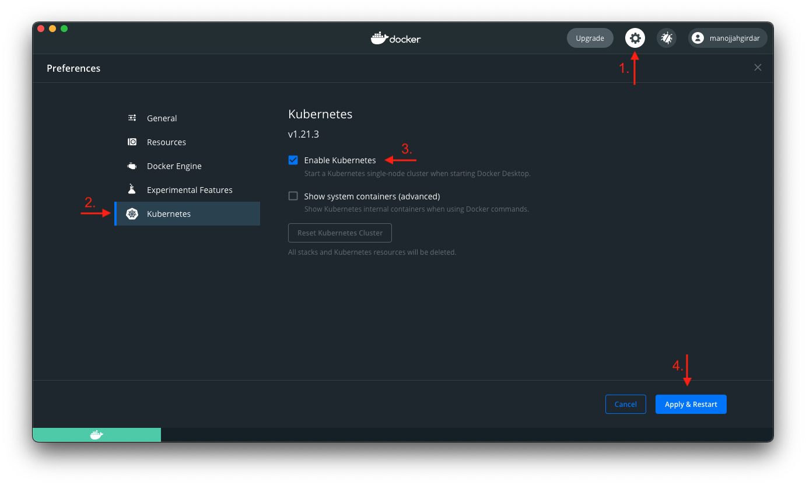
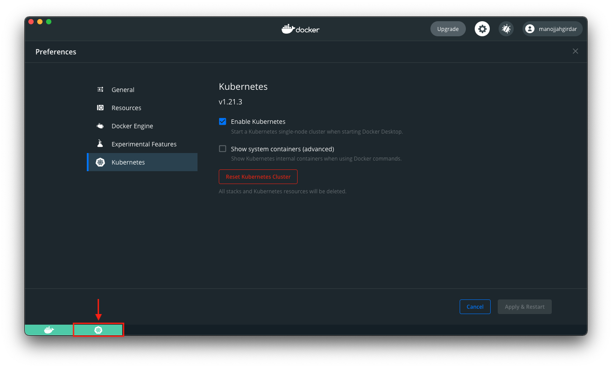

### 5.1. Create a Kubernetes cluster

!!! abstract "Managed Kubernetes Service (Paid)"
    * You can procure a managed Kubernetes service from the following providers:
        * [Create an EKS cluster on AWS](https://docs.aws.amazon.com/eks/latest/userguide/create-cluster.html) - Managed Kubernetes service from AWS
        * [Create an IKS cluster on IBM Cloud](https://cloud.ibm.com/kubernetes/catalog/create) - Managed Kubernetes service from IBM Cloud
        * [Create an AKS cluster on Azure](https://docs.microsoft.com/en-us/azure/aks/kubernetes-walkthrough-portal) - Managed Kubernetes service from Azure
        * [Create a GKE cluster on GCP](https://cloud.google.com/kubernetes-engine/docs/how-to/creating-a-zonal-cluster) - Managed Kubernetes service from Google Cloud Platform (GCP)

!!! abstract "Local Kubernetes Service (Free)"
    * You can use local Kubernetes cluster provided by Docker Desktop. To Enable this, install Docker Desktop and open it.
        * Click on the **gear** icon on top.
        * Select **Kubernetes** from the list.
        * Click on **Enable Kubernetes** checkbox.
        * Click on **Apply and Restart**.
      
      > Note: Kubernetes installation for Docker Desktop takes a few minutes and requires an internet connection.
        * Once enabled, please wait for the Kubernetes cluster to start. You can verify the successful start by checking the color of the Kubernetes cluster icon in the bottom left corner of the Docker Desktop window. The cluster icon will turn green when the cluster is ready.
        

### 5.2. Check Kubernetes context

* Once you have a Kubernetes cluster ready to use, you need to point your `kubectl` to the Kubernetes cluster. You can check the context by running the following command:
```bash
kubectl config current-context
```

* If you have setup local Kubernetes cluster with Docker Desktop, you will see output similar to the following:
```
docker-desktop
```

    ???+ warning "Important Note"
        If you have setup a managed Kubernetes cluster, your output may vary.

* Once you verify `kubectl` is pointing to the Kubernetes cluster, you can proceed to the next step. If `kubectl` is not pointing to the Kubernetes cluster, you can refer to [Managing Kubernetes Context using Kubectl](https://medium.com/@kritika.singhal/managing-kubernetes-context-using-kubectl-fe78a9cdc506) medium article which explains how to set the context.

### 5.3. Deploy App on Kubernetes

* You will be using the `deploy.yaml` script file to deploy the app on the Kubernetes cluster. 

* In terminal, run the following command:
```bash
kubectl apply -f deploy.yaml
```

* You will see output similar to the following:
```
deployment.apps/sample-app created
```

* You can see the deployment on your Kubernetes cluster by running the following command:
```bash
kubectl get deployment
```

* You will see output similar to the following:
```
NAME         READY   UP-TO-DATE   AVAILABLE   AGE
sample-app   1/1     1            1           6s
```

* You can also check the pods for the deployment by running the following command:
```bash
kubectl get pods
```

* You will see output similar to the following:
```
NAME                          READY   STATUS    RESTARTS   AGE
sample-app-7c7f988df8-rt76v   1/1     Running   0          4s
```

* Remember we had set the `replicas` to `1` in the `deploy.yaml` file. So, you will see only one pod running. You can increase the number of replicas by running the following command:
```bash
kubectl scale deployment sample-app --replicas=2
```

* You will see output similar to the following:
```
deployment.apps/sample-app scaled
```

* Now if you check the pods you will see two pods running.
```bash
kubectl get pods
```

* You will see output similar to the following:
``` hl_lines="3"
NAME                          READY   STATUS    RESTARTS   AGE
sample-app-7c7f988df8-rt76v   1/1     Running   0          58s
sample-app-7c7f988df8-sw89l   1/1     Running   0          54s
```

* You can check if the application is running inside the pod. In terminal, run the following command:
```bash
kubectl logs sample-app-7c7f988df8-666zb
```

* You will see output similar to the following:

    ```text title="Python Flask App Output"
    * Serving Flask app 'app' (lazy loading)
    * Environment: production
    WARNING: This is a development server. Do not use it in a production deployment.
    Use a production WSGI server instead.
    * Debug mode: on
    * Running on all addresses.
    WARNING: This is a development server. Do not use it in a production deployment.
    * Running on http://10.1.0.34:8080/ (Press CTRL+C to quit)
    * Restarting with stat
    * Debugger is active!
    * Debugger PIN: 113-374-682
    ```

    ```text title="NodeJs Express App Output"
    > express-app@1.0.0 start
    > node app.js

    Example app listening on port 3000!
    ```

* If you have followed the tutorial upto this point, the application will be running successfully inside the pod.

* To access the application you need to create a service.

### 5.4. Create service for the deployment

* A service for deployment is created to access the application from outside the cluster. The service exposes a port from the deployment. You can expose port from the service in three ways:

Types| Expose| Access| Example
----|------|------|-------
ClusterIP| Expose service through kubernetes cluster| Access service through `clusterIP:port`|http://192.168.29.2:5432
NodePort| Expose service through internal network VM's (external to kubernetes)| Access service through `clusterIP:nodePort`| http://192.168.29.2:30000 (note: nodePort is always in the range 30000-32767)
LoadBalancer| Expose service through external load balancer (external world)| Access service through `externalIP:port`| https://sample-app.amazonaws.com

* You will be using the `service.yaml` script file to create a service for the deployment.

* In terminal, run the following command:
```bash
kubectl apply -f service.yaml
```

* You will see output similar to the following:
```
service/sample-app created
```

* To check the service that you just created, run the following command:
```bash
kubectl get service
```

* You will see output similar to the following:

    ``` title="Python Flask App Output" hl_lines="3"
    NAME                   TYPE        CLUSTER-IP       EXTERNAL-IP   PORT(S)        AGE
    kubernetes             ClusterIP   10.96.0.1        <none>        443/TCP        5h8m
    my-flask-app-service   NodePort    10.104.140.122   <none>        80:32200/TCP   5h7m
    ```

    ``` title="NodeJs Express App Output" hl_lines="3"
    NAME                   TYPE        CLUSTER-IP       EXTERNAL-IP   PORT(S)        AGE
    kubernetes             ClusterIP   10.96.0.1        <none>        443/TCP        5h8m
    my-express-app-service NodePort    10.104.140.122   <none>        80:32201/TCP   5h7m
    ```

* Remember we had set the `type` to `nodePort` in the `service.yaml` file. So, you will have to access the service with `clusterIP:nodePort`. To get the ClusterIP run the following command:
```bash
kubectl get nodes -o wide | awk '{print $7}'
```

* If you have setup local Kubernetes cluster with Docker Desktop, you will see output similar to the following:
```
EXTERNAL-IP
<none>
```

    ???+ warning "Important Note"
        If you have setup a managed Kubernetes cluster, your output may vary. If you see multiple external IPs displayed, you can use any one of the external IPs.

    ???+ note
        Since local Kubernetes cluster is running on your machine, you will see `<none>` in the `EXTERNAL-IP` column. However, you can access the `clusterIP:nodePort` by simply visiting `localhost:nodePort`.

=== "Access Python Flask Application from Kubernetes"
    * To access the python flask application, visit `http://localhost:32200/` on your browser or run the following command:
    ```bash
    curl http://localhost:32200
    ```
    >Note: Remember we had defined `nodePort:32200` in the `service.yaml` file for python flask application. Also `localhost` is for local Kubernetes cluster. If you have setup a managed Kubernetes cluster, use the External-IP obtained from `kubectl get nodes -o wide | awk '{print $7}'` and the port `32200`.

    * You will see output similar to the following:
    ```
    <h1 align='center'>Hello World from Python Flask!</h1>
    ```

=== "Access NodeJs Express Application from Kubernetes"
    * To access the nodejs express application, visit `http://localhost:32201/` on your browser or run the following command:
    ```bash
    curl http://localhost:32201
    ```
    >Note: Remember we had defined `nodePort:32201` in the `service.yaml` file for nodejs express application. Also `localhost` is for local Kubernetes cluster. If you have setup a managed Kubernetes cluster, use the External-IP obtained from `kubectl get nodes -o wide | awk '{print $7}'` and the port `32201`.

    * You will see output similar to the following:
    ```
    <h1 align='center'>Hello World from NodeJs Express!</h1>
    ```

* If you see `Hello World` message, congrats! You have successfully deployed the application on a Kubernetes cluster.

!!! info "Learning Materials"
    - [Learn Kubernetes Basics](https://kubernetes.io/docs/tutorials/kubernetes-basics/)
    - [Running Multiple Instances of Your App (scaling the app)](https://kubernetes.io/docs/tutorials/kubernetes-basics/scale/scale-intro/)