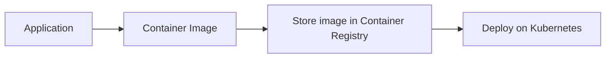

# Containers, Docker and Kubernetes for Beginners

As a Software Developer, my day to day job includes building Applications, APIs, etc. I use some popular frameworks such as Python-Flask, NodeJs-Express to build the applications or APIs. When I started my career, I would code an application and run it on my machine. And if a friend/colleague asked for the application, I would share the GitHub link and provide a set of instructions to get the app running on their machine. As naive as I sounded, I realized that is not how you distribute an application. There are best practices such as containerizing the application and deploying it on a Kubernetes cluster. Hence I started learning Containers, Docker and Kubernetes. There is a lot of good learning content on the internet. However, I still used to end up with challenges quite often. Challenges such as: "not knowing how to write a dockerfile", "dockerfile failed to build", "though the dockerfile built successfully, the image size would be large", "not knowing to write deployment scripts", "unable to access the deployed app from Kubernetes cluster", and the list goes on. Now that I'm a Senior Software Developer with 2+ years of experience in the IT field, I reflect on how Containers, Docker and Kubernetes made a difference to my application distribution. Hence I decided to simplify the topic "Containers, Docker and Kubernetes" and share my learnings and expertise with the developers, especially the beginners, through this simple hands-on tutorial.

In this tutorial, you will learn:

- How to build a basic python flask app or a basic NodeJs Express app 
- Containarize the application
- Store it in container registry
- Write a deployment script
- Deploy it on a kubernetes cluster

## Pre-requisite

1. [Python 3.x](https://www.python.org/downloads/)
1. [Docker Account](https://hub.docker.com/)
1. [Docker CLI](https://docs.docker.com/get-docker/)
1. [Kubernetes Cluster](deploy/#51-create-a-kubernetes-cluster)
1. [Kubectl CLI](https://kubernetes.io/docs/tasks/tools/)

## Steps

1. [Developing a basic Python or NodeJs Application](/build/)
1. [Containerizing the Application](/containerize/)
1. [Storing the Container Image in a Container Registry](/store/)
1. [Writing the deployment scripts](/deploy-script/)
1. [Deploying the Application on a Kubernetes Cluster](/deploy/)